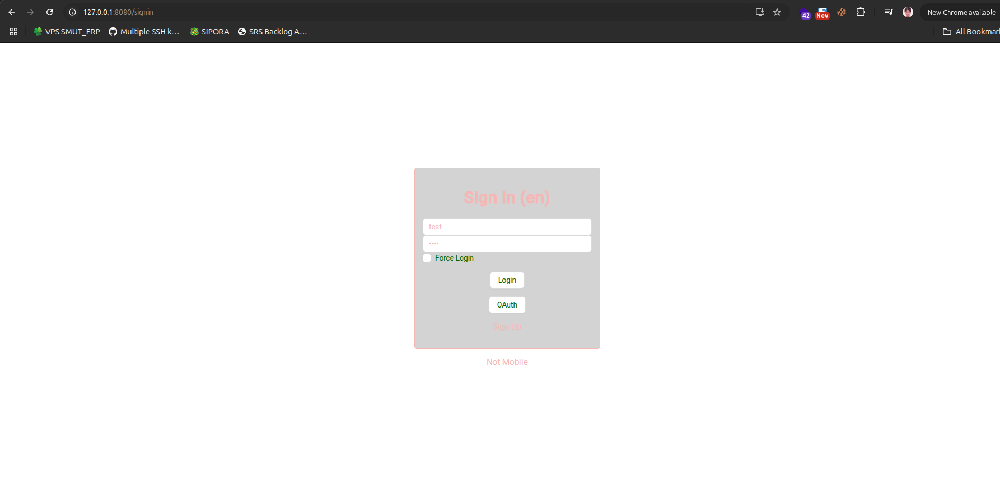
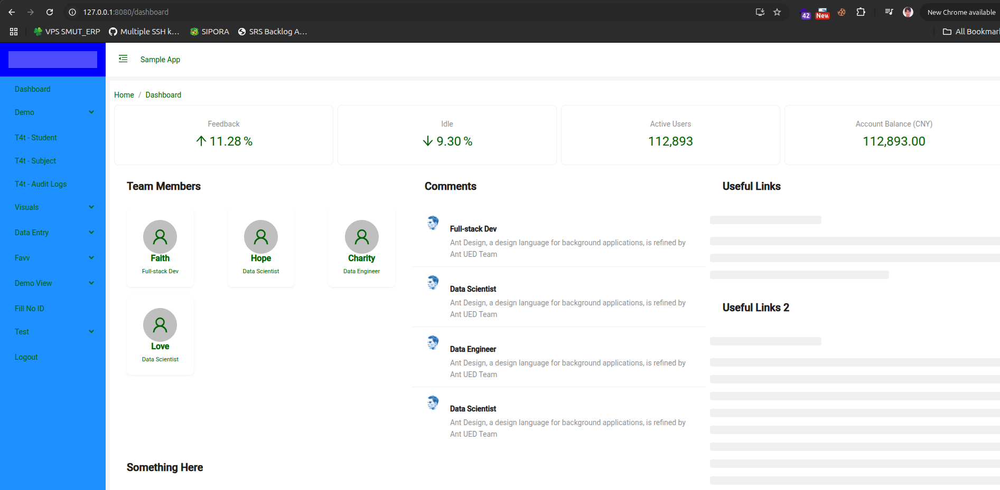

# VueJS + ExpressJS Assignment — Christian Tambunan

## ✅ Summary
Successfully ran the **ExpressJS backend** and **Vue Antd frontend** templates.  
After configuring the environment files, login was successful and the dashboard is accessible.

## 🧩 Steps Done
1. Cloned and installed dependencies for both repos.
2. Configured environment variables:
   - Backend: ensured SQLite DB connection works.
   - Frontend: set `VITE_API_URL=http://127.0.0.1:3000/api` and default url at =`http://127.0.0.1:8080/signin`.
3. Verified login with default seeded user.
   username : test
   password : test
4. Confirmed dashboard loads successfully.

## 💻 Environment
- OS: Ubuntu 24.04.2 LTS
- Node.js: v22.18
- NPM: v10.x
- Database: SQLite3 (pre-seeded)

## 📸 Evidence

## 📂 Repositories
- Backend: https://github.com/es-labs/express-template  
- Frontend: https://github.com/es-labs/vue-antd-template

---
**Christian Tambunan**
